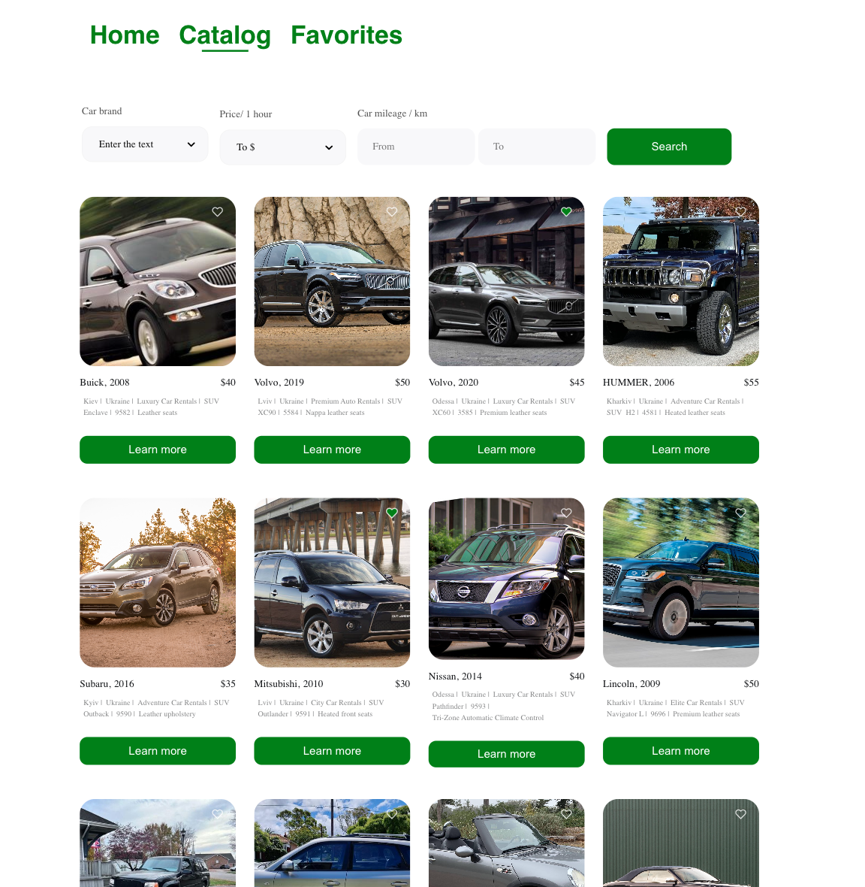
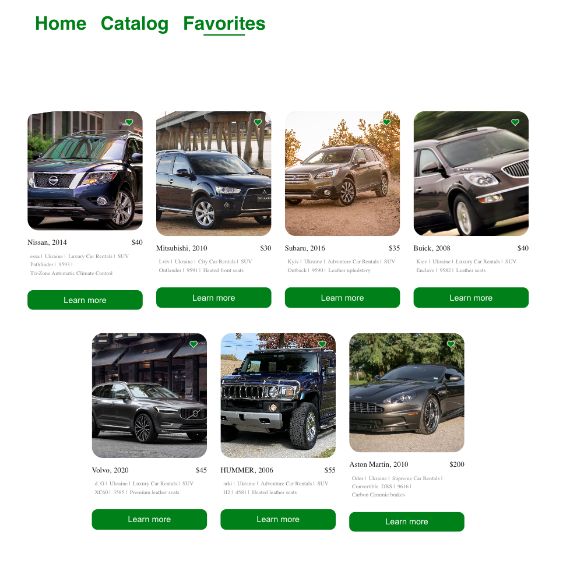
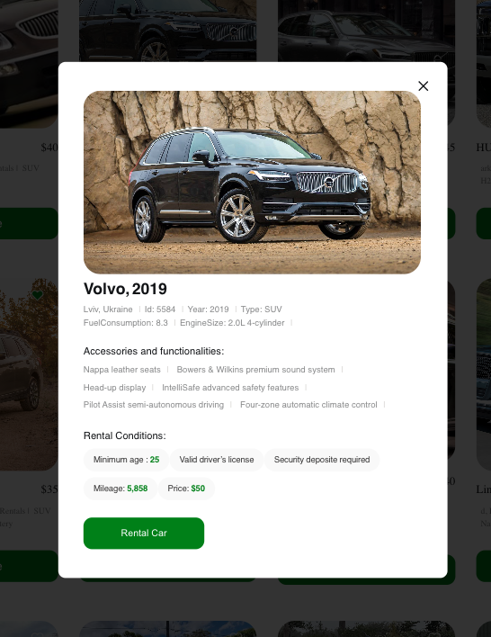

# 🚗 Cars Catalog

A modern car listing application with search, filters, and favorites. Users can browse available cars, filter by key parameters, and save their favorite vehicles.

🔗 **Live Demo**: [Cars App](https://vikasukhara.github.io/cars/)  
📁 **Repository**: [GitHub](https://github.com/VikaSukhara/cars)

---

## ✨ Features

- 🏠 Homepage with intro
- 🚙 Catalog with dynamic car listings
- 🔍 Filtering by make, price, mileage, and more
- ❤️ Add to Favorites (saved to localStorage)

---

## 🛠 Tech Stack

- **React** – UI library  
- **React Router** – navigation and routing  
- **JavaScript**  
- **CSS Modules** – scoped styling  
- **LocalStorage** – to store user favorites

---

## 👩‍💻 Role

This is an **individual project**. I developed the entire application:
- UI/UX structure
- Filter logic and favorites system
- Mobile-first responsive layout

---

## 📸 Screenshots

🚗 Car Catalog with Filters
Catalog page displaying all available cars with filtering options by brand, price, and mileage.
Each car card includes an image, key details, and a button to view more information in a modal.

⭐ Favorites Page
User-selected favorite cars are displayed here.
The favorites are stored in Redux and persisted automatically via redux-persist using localStorage.

🪟 Car Details Modal
Modal displaying detailed information about the selected car.
Includes rental conditions, accessories, and a phone button to contact rental service.
Closes on ESC key, clicking the close button, or outside the modal.

## 📬 Contact

📧 sukhara.vikrtoiia@gmail.com  
💼 [LinkedIn](https://www.linkedin.com/in/viktoriia-sukhara-31616a288)  
📱 [Telegram](https://t.me/vika_sukhara)
